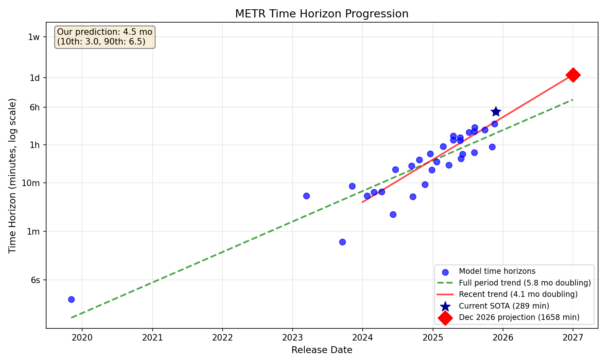
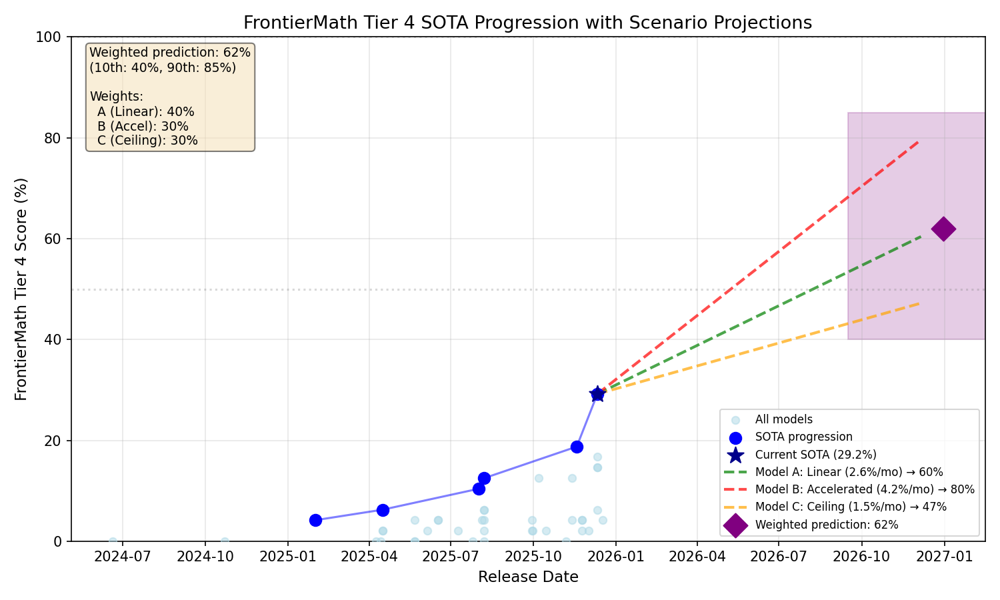
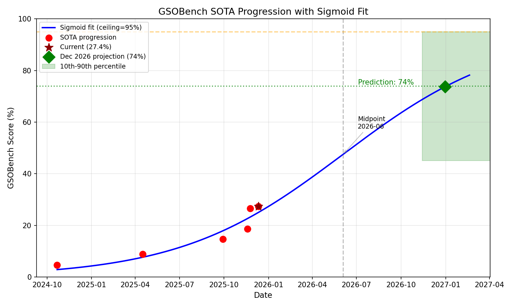
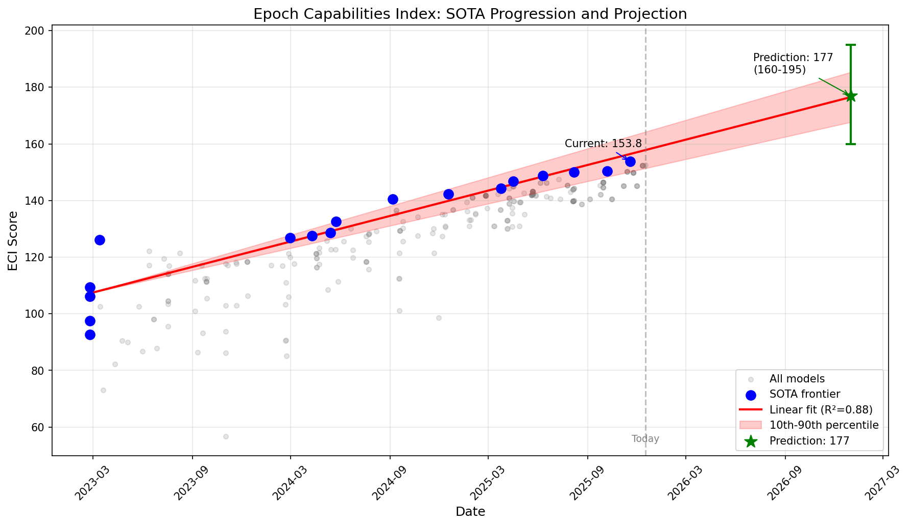
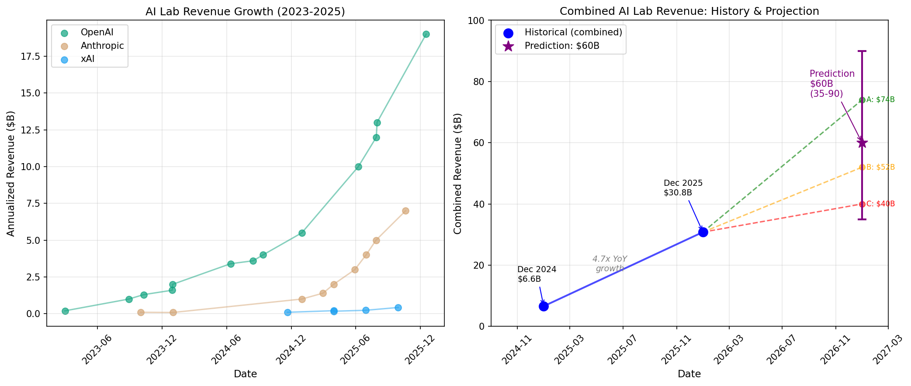

# 2026 AI Forecast Predictions Summary

My predictions for the [forecast2026.ai](https://forecast2026.ai) survey, covering AI benchmarks and societal impacts through December 31, 2026.

---

## 01: METR Horizon Doubling Time

### Prediction
**4.5 months** (10th: 3.0 mo, 90th: 6.5 mo)

### Rationale

We predict a median doubling time of **4.5 months** (10th: 3.0, 90th: 6.5). Regression on Epoch's 32-model dataset shows the long-term trend is ~5.75 months, but the 2024-2025 period accelerated to ~4.14 months. We anchor near the recent trend but shade slightly pessimistic (4.5 vs 4.1) because longer tasks (multi-day) may prove qualitatively harder. We widen bounds beyond the statistical CI to account for tail risks: the 10th percentile (3.0 mo) captures breakthrough scenarios, while the 90th (6.5 mo) covers disruptions like a Taiwan invasion affecting chip supply, regulatory slowdowns, or capability plateaus.

---

## 02: FrontierMath Tier 4

### Prediction
**62%** (10th: 40%, 90th: 85%)

### Rationale

We predict a median score of **62%** (10th: 40%, 90th: 85%). We use a weighted multi-model approach: (A) linear trend extrapolation at 2.6%/month → 60%, weighted 40%; (B) accelerated progress model at 4.2%/month based on recent RL-driven gains → 79%, weighted 30%; (C) ceiling/diminishing returns model at 1.5%/month → 47%, weighted 30%. Progress on this benchmark has been stepwise, driven by flagship model releases from OpenAI and Google. RL advances (IMO wins, Erdős solutions) suggest math may progress faster than other domains, but Tier 4 contains the hardest problems so some slowdown is plausible.

---

## 03: Remote Labor Index

### Prediction
**18%** (10th: 8%, 90th: 35%)

### Rationale
We predict a median automation rate of **18%** (10th: 8%, 90th: 35%). The RLI measures AI agents' ability to complete real freelance work to client-ready standards - currently at 3.75% with a 96% failure rate even for frontier models. Using FrontierMath Tier 4 as a reference class (similar early-stage trajectory from ~0%), we estimate ~1-2pp/month progress. The conservative model assumes "real work" is qualitatively harder than benchmarks (~12%), while the optimistic model follows FM-Tier4's acceleration pattern (~25%). Wide bounds reflect genuine uncertainty about whether end-to-end work reliability follows benchmark trajectories.

---

## 04: OpenAI-Proof Q&A

### Prediction
**37%** (10th: 18%, 90th: 55%)

### Rationale
We predict a median score of **37%** (10th: 18%, 90th: 55%). OPQA evaluates models on 20 internal OpenAI research/engineering bottlenecks that took senior engineers 1+ day to solve. Current best is GPT-5.1-Codex-Max at 8%. Using FrontierMath Tier 4 as the primary reference class (similar early-stage, hard benchmark), we model three scenarios: conservative (1.5pp/month → 26%), moderate with acceleration (→ 39%), and optimistic given OpenAI's explicit "AI research intern by Sep 2026" goal (→ 44%). Weighted 30/40/30, this yields ~37%. The wide range reflects uncertainty about whether real-world debugging follows benchmark patterns, balanced against OpenAI's clear prioritization of this capability.

---

## 05: GSOBench

### Prediction
**74%** (10th: 45%, 90th: 95%)

### Rationale

We predict GSOBench SOTA will reach **74%** (10th: 45%, 90th: 95%) by December 31, 2026. This prediction is based on fitting a sigmoid curve to the SOTA progression, which shows the benchmark is currently before its inflection point (projected for mid-2026). Using a 90-100% ceiling assumption—appropriate since the benchmark measures performance against human experts rather than a theoretical optimum—the sigmoid projects 71-76% by end of 2026. We centered on 74% and widened bounds to account for out-of-model factors including geopolitical risk, potential for AI to exceed human performance, and benchmark methodology changes.

---

## 06: Epoch Capabilities Index

### Prediction
**177** (10th: 160, 90th: 195)

### Rationale

We predict the Epoch Capabilities Index SOTA will reach **177** (10th: 160, 90th: 195) by December 31, 2026. This prediction is based on a linear regression fit to the SOTA progression since early 2023, which shows a consistent velocity of ~1.5 points/month with R² = 0.88. The statistical projection gives 176.5 with 10th/90th percentiles of 168/185; we widened these bounds to 160/195 to account for out-of-model factors including potential capability saturation, geopolitical disruptions, and possible breakthroughs.

---

## 07: AI Lab Revenues (OpenAI + Anthropic + xAI)

### Prediction
**$60B** (10th: $35B, 90th: $90B)

### Rationale

We predict combined annualized revenue for OpenAI, Anthropic, and xAI will reach **$60B** (10th: $35B, 90th: $90B) by December 31, 2026. This prediction uses a three-model approach: (A) company projections weighted 45%, (B) hyper-growth startup reference class weighted 35%, and (C) a slowdown/ceiling scenario weighted 20%. The combined revenue grew 4.7x YoY from Dec 2024 ($6.6B) to Dec 2025 ($30.8B), but we expect growth to decelerate as companies face the historical challenge of sustaining 2-3x growth at scale—no company has ever grown from ~$10B to $100B in 3 years.

---

## 08: Public Importance Poll (Gallup)

### Prediction
**1.0%** (10th: 0.3%, 90th: 8%)

### Rationale
We predict **1.0%** (10th: 0.3%, 90th: 8%) of Americans will name AI/technology as the most important problem facing the country by December 31, 2026. This is based on Gallup's "Most Important Problem" poll, where AI/technology currently registers at only 0.44% (4-month average). Public opinion polls are sticky, and technology issues historically don't become dominant concerns. However, we assign meaningful probability to a tail scenario (8% at 90th percentile) where major AI-driven job losses or a significant incident causes AI to become a mainstream political issue.

---

## 09: METR Developer Uplift Study

### Prediction
**1.4x** (10th: 0.90x, 90th: 2.2x)

### Rationale
We predict the METR developer uplift study will show a **1.4x** speedup (10th: 0.90x, 90th: 2.2x) when replicated with late-2026 AI tools. The original early-2025 study found a surprising 0.84x slowdown with Claude 3.5/3.7 Sonnet, contradicting expert predictions of 1.6x speedup. However, significant capability improvements (Opus 4.5 shows median 100% productivity gains in Anthropic's internal survey) suggest the 2026 replication will likely show net speedup. We center on 1.4x as a compromise between process-driven estimates (~1.35x) and intuition informed by direct experience with newer models (~1.5x), with wide bounds reflecting genuine uncertainty.

---

## 10: YouGov AI Sentiment Poll

### Prediction
**-14pp** (10th: -40pp, 90th: +15pp)

### Rationale
We predict the YouGov AI net sentiment score will be **-14pp** (10th: -40pp, 90th: +15pp) by December 31, 2026. Net sentiment dropped from +1pp (Dec 2024) to -11pp (Aug 2025) with significant volatility, hitting -21pp in June before recovering. We model three scenarios: (A) utility dominates and AI becomes beloved like Amazon, (B) base case where competing forces roughly cancel, and (C) job fears dominate and AI faces major backlash. The very wide bounds (55pp range) reflect genuine uncertainty about which force will dominate, limited historical data, and the potential for public opinion to shift rapidly.

---

## Summary Table

| # | Topic | Current | Prediction | 10th | 90th |
|---|-------|---------|------------|------|------|
| 01 | METR Horizon Doubling Time | 4.7 mo | **4.5 mo** | 3.0 mo | 6.5 mo |
| 02 | FrontierMath Tier 4 | 29.2% | **62%** | 40% | 85% |
| 03 | Remote Labor Index | 3.75% | **18%** | 8% | 35% |
| 04 | OpenAI-Proof Q&A | 8% | **37%** | 18% | 55% |
| 05 | GSOBench | 26.5% | **74%** | 45% | 95% |
| 06 | Epoch Capabilities Index | 154 | **177** | 160 | 195 |
| 07 | AI Lab Revenues | $31B | **$60B** | $35B | $90B |
| 08 | Public Importance | 0.44% | **1.0%** | 0.3% | 8% |
| 09 | METR Uplift Study | 0.84x | **1.4x** | 0.90x | 2.2x |
| 10 | YouGov Sentiment | -11pp | **-14pp** | -40pp | +15pp |
